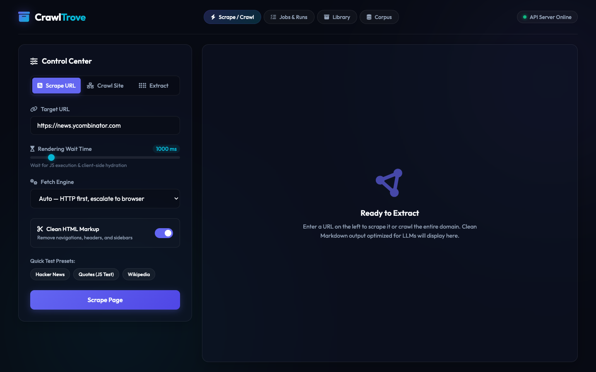
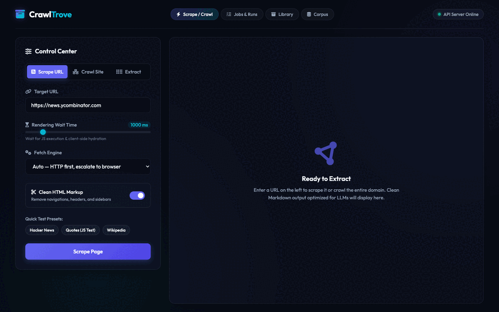
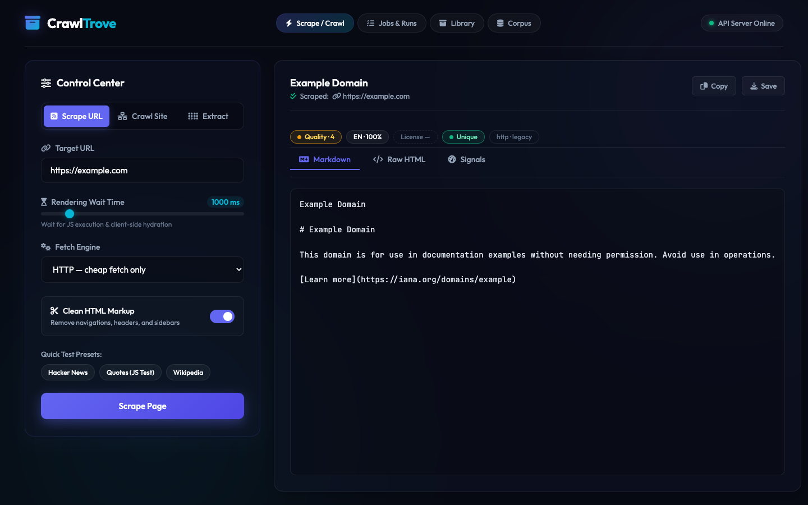
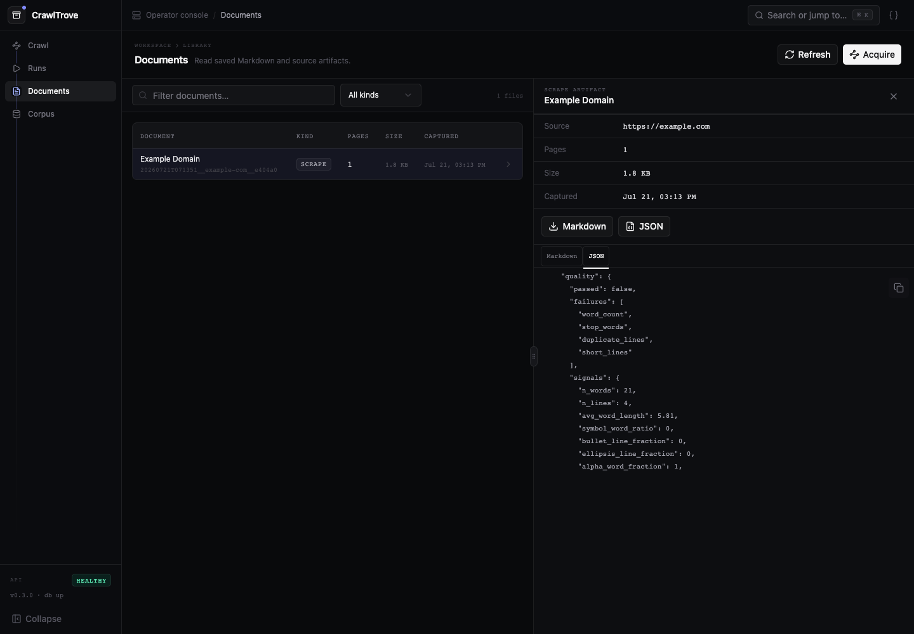

# CrawlTrove

CrawlTrove is a self-hosted web scraper and crawler that turns web pages,
documents, and images into clean Markdown plus corpus-ready metadata. It uses a
fast HTTP fetch first and escalates to Playwright only when a page needs a real
browser.

The supported Docker runtime includes a local Next.js operator GUI for starting
crawls, inspecting runs and saved documents, and browsing corpus records. It
also exposes the JSON API and optional stdio MCP adapter.



> Crawl responsibly. You are responsible for respecting website terms,
> robots.txt, rate limits, privacy, and the licenses of collected content. The
> MIT license covers CrawlTrove itself, not data produced with it.

## See it in action

Scrape a public URL, inspect the clean Markdown, then drill into provenance and
corpus-quality signals.



### Clean Markdown output



### Quality metadata



## Quick start

Docker is the supported runtime. Docker Compose v2 is required.

```bash
docker compose up --build
```

Then open:

- Dashboard: <http://localhost:8000>
- API documentation: <http://localhost:8000/docs>
- Health check: <http://localhost:8000/api/health>

Verify the service from another terminal:

```bash
curl -fsS http://localhost:8000/api/health
```

The default Compose configuration publishes only to `127.0.0.1`. It starts
without authentication for local use and stores artifacts plus Postgres data
in Docker named volumes.

Stop the service with `docker compose down`. Adding `--volumes` permanently
deletes both the local database and all saved scrape artifacts; back them up
first.

## Scrape a page

```bash
curl -fsS http://localhost:8000/api/scrape \
  -H 'Content-Type: application/json' \
  -d '{
    "url": "https://example.com",
    "engine": "auto",
    "onlyMainContent": true
  }'
```

A successful response contains clean `markdown`, cleaned `html`, and metadata
for the source URL, fetch engine, extractor, language, quality, license, and
duplicate detection.

## Main API routes

| Route | Purpose |
| --- | --- |
| `POST /api/scrape` | Scrape one page or document. |
| `POST /api/crawl` | Start a same-domain crawl. |
| `GET /api/crawl/{jobId}` | Poll crawl progress. |
| `POST /api/map` | Discover URLs without scraping every page. |
| `POST /api/batch/scrape` | Scrape up to 50 explicit URLs. |
| `POST /api/extract` | Extract JSON matching a supplied schema. |
| `POST /api/search/web` | Search through the configured web-search provider. |
| `GET /api/search/hybrid` | Search indexed artifacts and corpus records. |
| `POST /api/research` | Start a budget-limited research run. |
| `POST /api/llmstxt` | Generate `llms.txt` and `llms-full.txt`. |
| `GET /api/health` | Liveness and optional database state. |

The OpenAPI schema at `/docs` is the authoritative request and response
reference.

## MCP server

With CrawlTrove running, start its stdio MCP adapter from the repository root:

```bash
python3.11 -m venv .venv
.venv/bin/python -m pip install -r requirements-mcp.txt
CRAWLTROVE_BASE_URL=http://localhost:8000 .venv/bin/python -m crawltrove_mcp
```

Register that command in your MCP client with the repository as its working
directory. Set `CRAWLTROVE_API_KEY` when the service uses `API_KEYS`, or set
`CRAWLTROVE_USER` and `CRAWLTROVE_PASSWORD` when it uses Basic authentication.
The adapter exposes `scrape`, `search_web`, `search`, `start_crawl`, and
`get_crawl`; crawl bodies stay in CrawlTrove so polling does not flood the model
context.

## What it extracts

- HTML through `trafilatura`, with a BeautifulSoup/markdownify fallback.
- JavaScript-rendered pages through Playwright when HTTP output is insufficient.
- PDF and EPUB documents, with Tesseract OCR for image-only pages.
- Image URLs through OCR.
- Per-page license, language, quality, deduplication, and change signals.
- Raw JSON and Markdown artifacts under `data/`.

Optional features are inactive until configured: LLM extraction/research,
semantic embeddings, webhooks, and external search providers.

## Configuration

No `.env` file is required for local use. Copy `.env.example` only when you
need overrides:

```bash
cp .env.example .env
```

Common settings:

| Variable | Purpose |
| --- | --- |
| `APP_USERNAME`, `APP_PASSWORD` | HTTP Basic authentication. |
| `API_KEYS` | Comma-separated keys accepted through `X-API-Key`. |
| `BIND_ADDRESS` | Compose host bind; defaults to `127.0.0.1`. |
| `ALLOW_UNAUTHENTICATED` | Explicitly permit an unauthenticated non-loopback bind; unsafe. |
| `ALLOW_PRIVATE_NETWORKS` | Permit localhost/private-network targets; unsafe for untrusted users. |
| `CORS_ORIGINS` | Comma-separated browser origins; CORS is off by default. |
| `DATABASE_URL` | Postgres connection; Compose defaults to its bundled database. |
| `LOCAL_LLM_BASE_URL`, `LOCAL_LLM_MODEL` | OpenAI-compatible local LLM endpoint. |
| `ANTHROPIC_API_KEY` | Anthropic extraction/research backend. |
| `EMBEDDINGS_BASE_URL`, `EMBEDDINGS_MODEL` | OpenAI-compatible embedding endpoint. |
| `SEARXNG_BASE_URL`, `BRAVE_SEARCH_API_KEY` | Optional web-search provider. |
| `WEBHOOK_URL`, `WEBHOOK_SECRET` | Signed completion webhooks. |
| `DATA_DIR` | Host-mode artifact directory; Compose uses `/workspace/data` in a named volume. |
| `LOG_LEVEL`, `LOG_FORMAT` | Logging verbosity and optional JSON output. |

### Network deployment

Do not expose an unauthenticated scraper to a LAN or the public internet. To
listen beyond the local machine, set authentication and change the host bind:

```dotenv
BIND_ADDRESS=0.0.0.0
APP_PASSWORD=replace-with-a-long-random-password
```

For cross-origin browser clients, set an explicit `CORS_ORIGINS` allowlist.

CrawlTrove applies an application-level block to loopback, private, link-local,
and other non-public targets. `ALLOW_PRIVATE_NETWORKS=true` is intended only
for a trusted operator scraping internal services. An internet-facing or
multi-user deployment must also enforce an outbound firewall that denies those
networks; browser DNS cannot be pinned entirely in application code.

## Upgrading from an earlier local checkout

The renamed Compose stack deliberately uses new `crawltrove_data` and
`crawltrove_pgdata` volumes. It does not reuse or alter volumes initialized
by the earlier private prototype.

Back up the existing database and `data/` directory before switching
versions. After building the new image, copy file artifacts into the new named
volume before starting the service:

```bash
docker compose build
docker compose run --rm --no-deps \
  -v ./data:/migration-source:ro \
  crawltrove sh -c 'cp -R /migration-source/. /workspace/data/'
```

For Postgres, create a custom-format dump with `pg_dump --format=custom`
while the earlier version is still running. Start the new database, copy the
dump into it, and restore without the former owner:

```bash
docker compose up -d db
docker compose cp crawltrove-backup.dump db:/tmp/crawltrove-backup.dump
docker compose exec db pg_restore --clean --if-exists --no-owner \
  -U crawltrove -d crawltrove /tmp/crawltrove-backup.dump
```

Keep the backups until the dashboard and database-backed searches show the
expected records. The former volumes remain untouched for rollback.

## Development

Host-side tests do not require a browser download. Python 3.11 is the supported
development version.

```bash
python3.11 -m venv .venv
.venv/bin/python -m pip install -r requirements-dev.txt
.venv/bin/python -m pytest
```

The App Router dashboard lives in `apps/app/`. Docker builds its static export
and serves it from FastAPI, so the supported runtime does not need a Node
process. For frontend-only development, keep FastAPI on port 8000 and run the
Next.js development server with its same-origin proxy:

```bash
cd apps/app
pnpm install --frozen-lockfile
FASTAPI_URL=http://127.0.0.1:8000 pnpm dev
```

Then open <http://localhost:3000>. Use `FASTAPI_URL` only on the Next.js server;
do not expose a backend URL in browser JavaScript unless cross-origin access is
explicitly configured.

Database-backed tests automatically skip when local Postgres is unavailable.
See [CONTRIBUTING.md](CONTRIBUTING.md) for the contribution workflow and
[SECURITY.md](SECURITY.md) for private vulnerability reporting.

## Architecture

`app/scraper.py` owns the scrape pipeline:

1. Validate the target as a public HTTP(S) URL.
2. Fetch with `curl_cffi` using a browser TLS fingerprint.
3. Escalate SPA shells, challenges, and block responses to Playwright.
4. Extract content and compute corpus signals.
5. Persist artifacts; optionally index metadata in Postgres and sqlite-vec.

The offline corpus tools under `app/corpus/` and `scripts/` consume saved
artifacts. The live service does not depend on the corpus pipeline.

## Evaluation and limitations

See the [frontier web-scraping evaluation](docs/frontier-scraping-evaluation.md)
for live acquisition benchmarks, comparisons with managed and open-source
scraping tools, known browser and anti-bot limitations, and the recommended
roadmap.

## License

CrawlTrove is released under the [MIT License](LICENSE).
See [THIRD_PARTY_NOTICES.md](THIRD_PARTY_NOTICES.md) for bundled third-party
material.
